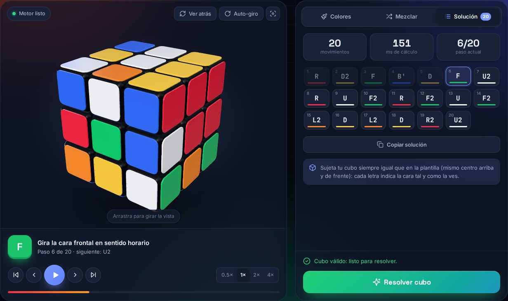

# Resolvedor de Rubik

Web para resolver el cubo de Rubik 3×3 paso a paso. Copias los colores de tu cubo, pulsas **Resolver** y sigues la solución giro a giro en un cubo 3D animado. Casi siempre son 20 movimientos o menos.



## Características

- **Visor 3D interactivo** hecho con Three.js: arrastra para girar la vista, cambia a la cara trasera o activa el giro automático.
- **Pintar los colores** en una plantilla desplegada o tocando directamente las pegatinas del cubo 3D, con recuento de colores y deshacer.
- **Validación completa**: avisa si falta algún color, si una esquina está girada, una arista volteada o hay dos piezas intercambiadas.
- **Algoritmo de dos fases de Kociemba** implementado desde cero en JavaScript. Se ejecuta en un Web Worker, así que la interfaz no se bloquea y nada sale del navegador.
- **Reproductor de la solución** con play/pausa, paso a paso, saltos a cualquier movimiento, cuatro velocidades y la explicación de cada giro en español.
- **Patrones**: las banderas de México y Francia y diez diseños clásicos (tablero de ajedrez, cubo en cubo, superflip…) que se forman paso a paso desde el cubo resuelto.
- **Tu propio dibujo**: pinta en la plantilla lo que quieras ver en el cubo y la web calcula los giros para conseguirlo desde el cubo resuelto (si el dibujo es posible).
- **Mezclas** aleatorias o escritas a mano en notación estándar (`R U R' U'`, `F2`, `Rw`, `M`, `x`, `(R U)3`…) y giros manuales con botones o con el teclado.
- Tema oscuro y claro, diseño adaptado a móvil y el estado se guarda al recargar.

### Atajos de teclado

| Tecla | Acción |
| --- | --- |
| `U` `R` `F` `D` `L` `B` (`M` `E` `S` `X` `Y` `Z`) | Gira esa cara; con `Mayús`, al revés |
| `Espacio` | Reproducir / pausar la solución |
| `←` `→` | Paso anterior / siguiente |
| `Inicio` `Fin` | Ir al principio / al final |
| `1`–`6`, `0` | Elegir color / borrador (pestaña Colores) |
| `Ctrl` + `Z` | Deshacer |

## Uso en local

No hace falta compilar nada: es una web estática. Como usa módulos ES y un Web Worker, hay que servirla por HTTP (abrir `index.html` con doble clic no funciona):

```bash
npm start          # http://localhost:5173
```

Sirve también cualquier otro servidor estático (`python3 -m http.server`, etc.).

## Pruebas

```bash
npm test
```

Las pruebas comprueban que el modelo de pegatinas y el de piezas coinciden, que se resuelven mezclas aleatorias en 22 movimientos o menos, que se detectan los estados imposibles y que se interpreta bien la notación.

## Publicar en GitHub Pages

En **Settings → Pages** del repositorio, elige *Deploy from a branch*, la rama que quieras publicar y la carpeta `/ (root)`. No hay paso de compilación.

## Estructura

```
index.html              Página principal
css/styles.css          Estilos (temas claro y oscuro)
js/app.js               Interfaz: plantilla, pestañas, reproductor, teclado
js/cube-model.js        Modelo de pegatinas, movimientos y notación
js/cube3d.js            Visor 3D con Three.js
js/solver/kociemba.js   Algoritmo de dos fases (tablas de movimientos y de poda + búsqueda)
js/solver/worker.js     Web Worker que ejecuta el resolvedor
vendor/three.min.js     Three.js empaquetado (solo lo que se usa)
scripts/                Servidor local y entrada para empaquetar Three.js
tests/                  Pruebas con node:test
```

`vendor/three.min.js` se genera con `npm install && npm run build:vendor` a partir de `scripts/three-entry.js`, y se incluye en el repositorio para que la web funcione sin compilar.

## Créditos

- Algoritmo de dos fases de [Herbert Kociemba](https://kociemba.org/cube.htm).
- [Three.js](https://threejs.org/) (licencia MIT).
- Tipografías Inter, Space Grotesk y JetBrains Mono de Google Fonts.
